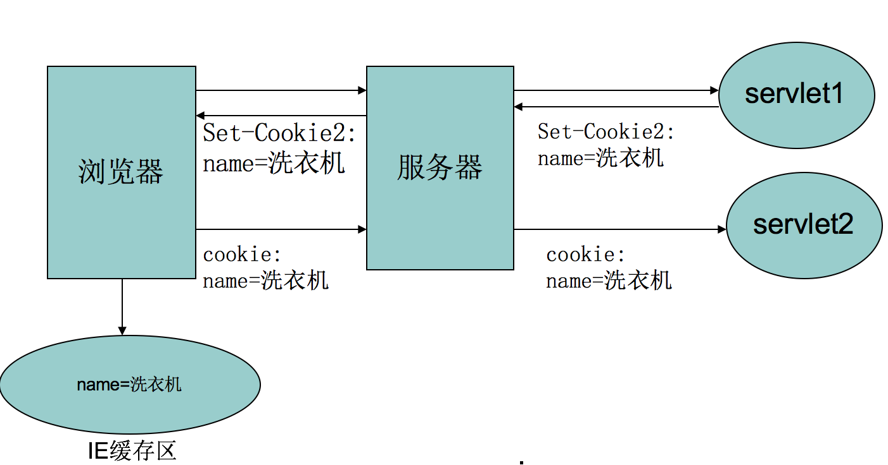
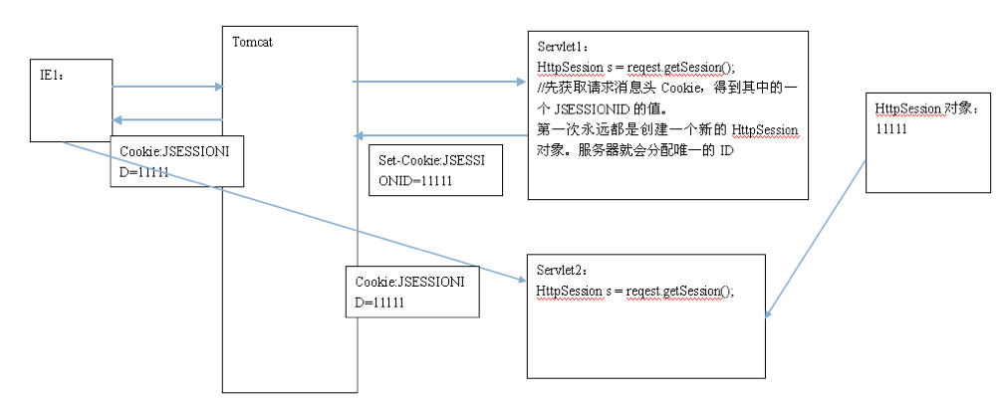
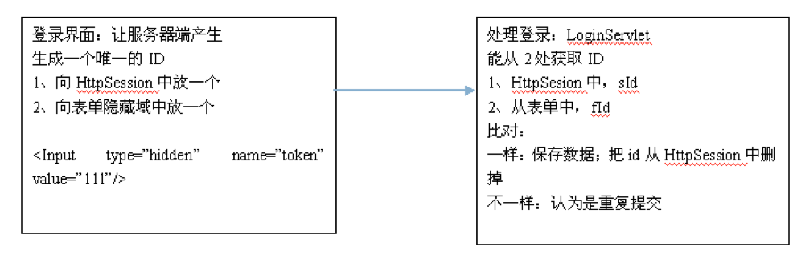
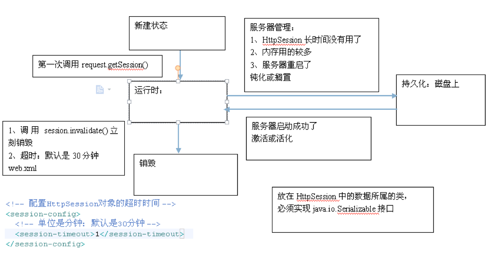

# 1、cookie和session
Web 程序的请求与响应是基于HTTP ，它为无状态的通信协议，服务器不会"记得"这次请求与下一次请求之间的关系.然而有些功能是必须由多次请求来完成，
例如购物车，用户可能在多个购物网页之间采购商品， Web 应用程序必须有个方式来"得知"用户在这些网页中采购了哪些商品，这种记得此次请求与之后请求间关系的方式，
就称为会话管理(session Management) 

## 1.1、什么是会话？ 
会话可简单理解为：用户开一个浏览器，点击多个超链接，访问服务器多个web资源，然后关闭浏览器，整个过程称之为一个会话。会话是访问特定web站点时用户执行的一
组活动，记住不同会话过程称为会话跟踪。

## 1.2、会话过程中要解决的一些问题？
每个用户与服务器进行交互的过程中，各自会有一些数据，程序要想办法保存每个用户的数据。

例如：用户点击超链接通过一个 servlet 购买了一个商品，程序应该保存用户购买的商品，以便于用户点结帐 servlet 时，结帐 servlet 可以得到用户商品为用户
结帐。

## 1.3、隐藏域
制作一个网络问卷，由于问卷内容很长，因此必须分几个页面，上一页面作答完后，必须请求服务器显示下一个页面.但是在HTTP 协议中，服务器并不会记得上一次请求的状态，
既然服务器不会记得两次请求间的关系，那就由浏览器在每次请求时主动告知服务器多次请求间必要的信息，服务器只要单纯地处理请求中的相关信息即可.

隐藏域就是主动告知服务器多次请求间必要信息的方式之一.以问卷作答的为例

上一页的问卷答案，可以用隐藏域的方式放在下一页的窗体中，这样发送下一页窗体时，就可以一并发送这些隐藏壤，每一页的问卷答案就可以保留下来。
那么上一次的结果如何成为下一页的隐藏域呢?做法之一是将上一页的结果发送至服务器，由服务器将上一页结果以隐藏域的方式再响应给浏览器

使用隐藏域的方式，在关掉网页后，显然会遗失先前请求的信息，所以仅适合用于一些简单的状态管理，如在钱问卷。由于在查看网页源代码时，就可以看到隐藏域
的值，因此这个方法不适合用于隐密性较高的数据.

**隐藏域也不是 Servletl JSP 实际管理会话时的机制**

## 1.4、URL 重写
所谓 URL 重写，就是 GET 请求参数的应用

当服务器响应浏览器上一次请求时，将某些相关信息以超链接方式响应给浏览器，超链接中包括请求参数信息

因为URL 重写是在URL之后附加参数并用超链接发送的方式，所以必须以 GET 方式发送请求，再加上 GET 本身可以携带的请求参数长度有限，
因此大量的客户端信息并不适合使用 URL 重写

通常 URL 重写是用在一些简单的客户端信息保留，或者是辅助会话管理 —— HttpSession 会话管理机制的原理之一，就与 URL 重写有关

# 2、保存会话数据的两种核心技术

## 2.1、Cookie

Cookie 是客户端技术

程序把每个用户的数据以 cookie 的形式写给用户各自的浏览器。当用户使用浏览器再去访问服务器中的web资源时，就会带着各自的数据去，这样，web资源处理的就是用户各自的数据了。

Cookie 是在浏览器（客户端）存储信息的一种方式，服务器可以响应浏览器 set-cookie 标头，浏览器收到这个标头与数值后，会将它以文件的形式存储在计算机上，这个文件就称
之为Cookie

可给 Cookie 一个存活期限，如果关闭浏览器之后，再次打开浏览器并连接服务器时，这些 Cookie 仍在有效期限，浏览器会使用 cookie 标头自动将Cookie 发送给服务器，
服务器就可以得知一些先前浏览器请求的相关信息.因为 Cookie 可以设定存活期限，所以在客户端存储的信息可以活得更久一些(除非用户主动清除 Cookie 信息).

有些购物网站会使用Cookie 来记录用户的浏览情况，虽然用户没有实际购买商品，但在下次用户访问时，仍可以根据 Cookie 中保持的浏览历史记录为用户建议购物清单。



### 2.1.1、Cookie API
javax.servlet.http.Cookie 类用于创建一个Cookie，response 接口也中定义了一个 addCookie 方法，它用于在其响应头中增加一个相应的 Set-Cookie 头字段。 
同样，request接口中也定义了一个 getCookies 方法，它用于获取客户端提交的 Cookie。Cookie类的方法： 
```
public Cookie(String name,String value);

setValue与getValue方法 

setMaxAge与getMaxAge方法 

setPath与getPath方法   

setDomain与getDomain方法

getName方法 
```

### 2.1.2、Cookie细节
一个 Cookie 只能标识一种信息，为k-v形式，它至少含有一个标识该信息的名称（NAME）和设置值（VALUE）。

```
Cookie的特性
1.1 属性：
        name：   名称 必选
        value：  取值（不能存中文） 必选
        path：   可选的。路径。默认是写 Cookie 的那个程序的访问路径。
        maxAge： 可选的。最大存活时间。默认是一次会话，存在了浏览器进程的内存中。
        version：可选的。版本号
        domain:  可选的。域名。默认就是写 Cookie 的那个网站
        comment：可选。注释
```    
 
一个 WEB 站点可以给一个 WEB 浏览器发送多个 Cookie，一个 WEB 浏览器也可以存储多个 WEB 站点提供的 Cookie。

浏览器一般只允许存放 300 个 Cookie，每个站点最多存放 20 个 Cookie，每个 Cookie 的大小限制为 4KB。

cookie 属于稀缺资源！

如果创建了一个cookie，并将他发送到浏览器，默认情况下它是一个会话级别的 cookie（即存储在浏览器的内存中），用户退出浏览器之后即被删除。
若希望浏览器将该cookie存储在磁盘上，则需要使用 maxAge，并给出一个以秒为单位的时间。将最大时效设为 0 ，则是命令浏览器删除该cookie。
注意，删除cookie时，path必须一致，否则不会删除(默认：产生cookie服务器资源所在path)

在 Servlet 3.0 中， Cookie 类新增了 cookie.setHttpOnly(boolean); 可以将 Cookie 标示为仅用于 HTTP. 会在 set-cookie 标头上附加 HttpOn1y 属性，在浏览器支持的情况下，这
个 Cookie 不会被客户端脚本(例如JavaScript)读取，可以使用 isHttpOnly() 来得知一个 Cookie 是否被 setHttpOnly() 标示为仅用于HTTP 。

### 2.1.3 Cookie应用
比如：显示用户上次浏览过的商品，自动登录等

## 2.2、Session
Session 是服务器端技术

在WEB开发中，服务器可以为每个用户浏览器创建一个会话对象（session对象），注意：一个浏览器独占一个session对象(默认情况下)。
因此，在需要保存用户数据时，服务器程序可以把用户数据写到用户浏览器独占的session中，当用户使用浏览器访问其它程序时，其它程序可以从用户的session中取出
该用户的数据，为用户服务。

在Servlet/JSP 中，如果想要进行会话管理，可以使用HttpServletRequest 的 getSession 方法取得 HttpSession 对象。该方法有两个版本
- 一个版本 无参数
- 一个版本 可以传入布尔值，默认是true，表示若尚未存在 HttpSession 实例，直接创建一个新的对象。若传入false ，若尚未存在 HttpSession 实例，
则直接返回null.

HttpSession 上最常使用的方法大概就是 setAttribute() 与 getAttribute()，这与 HttpServletRequest 的 setAttribute() 与 getAttribute() 类似，
可以让你在对象中设置及取得属性，这是可以存放属性对象的第二个地方( Servlet API 中第三个可存放属性的地方是在 ServletContext 中)。

如果想在浏览器与 Web 应用程序的会话期间，保留请求之间的相关信息，可以使用 HttpSession 的 setAttribute() 方法将相关信息设置为属性.
在会话期间，你就可以当作 Web 应用程序"记得"客户端的信息，如果想取出这些信息，则通过 HttpSession 的 getAttribute() 就可以取出.

你完全可以从Java 应用程序的角度出发来进行会话管理，而忽略HTTP 无状态的事实。

如果想在此次会话期间，直接让目前的 HttpSession 失效，可以执行HttpSession的 invalidate 方法. 一个使用的时机就是实现注销机制

**HttpSession 并非线程安全，所以必须注意属性设定时共享存取的问题。**

### 2.2.1、 Session和Cookie的主要区别在于
- Cookie 是把用户的数据写给用户的浏览器（客户端技术）
- Session 把用户的数据写到用户独占的 session 中（服务器端技术）。Session 对象由服务器创建，开发人员可以调用 request 对象的 getSession 方法得到 session 对象。

### 2.2.2、session实现原理
使用 HttpSession 进行会话管理十分方便，让 Web 应用程序看似可以"记得"浏览器发出的请求，但无论如何. Web 应用程序基于 HTIP 协议的事实并没有改变，



尝试运行 HttpservletRequest 的 getSession()时. Web 容器会创建HttpSession 对象。关键在于每个HttpSession 对象都会有个特殊的ID. 称为Sesslon ID. 

可以执行 HttpSession 的 getId() 取得 Session ID ，这个 Session ID 默认会使用 Cookie 存放在浏览器中。在Tomcat 中，Cookie 的名称是 JSESSIONID. 
数值则是 getId() 所取得的Session ID.

由于Web 容器本身是执行于JVM 中的一个Java 程序，通过getSession ()取得HttpSession 是Web 容器中的一个Java 对象. 
HttpSession 中存放的属性，自然也就存放于服务器端的Web 容器之中.

每一个HttpSession 各有一个 Session ID. 当浏览器请求应用程序时，会将Cookie 中存放的Session id 一并发送给应用程序. Web 容器会根据Session id 来
找出对应的HttpSession 对象，这样就可以取得各浏览器个别的会话数据

所以使用HttpSession 来进行会话管理时，设定为属性的对象是存储在服务器端，而Session ID 默认使用Cookie 存放于浏览器端。
Web 容器存储Session ID 的Cookie 默认为关闭浏览器就失效，所以重新启动浏览器请求应用程序时，通过getSession ()取得的是新的HttpSession 对象。


> 如果想继续在关闭浏览器后，session id 依然能有效，就需要手动设置 cookie

在Servlet 3.0 中新增了 SessionCookieConfig 接口，可以通过 ServletContext 
的 getSessionCookieConfig 取得实现该接口的对象，ServletContext 可以通过Servlet 实例的 getServletContext() 取得。通过 sessionCookieConfig 对象，
可以设定存储 Session ID 的 Cookie 相关信息                                          
- 例如，可以通过"setName” 将默认的Session ID 名称修改为别的名称，通过 setAge 设定存储 Session ID 的Cookie 存活期限等，单位是 秒

但是要注意的是，设定SessionCookieConfig 必须在ServletContext 初始化之前，所以实际上要修改Session ID、存储Session ID 的Cookie 存活期限等信息时，必须在
web.xml 中设定
```xml
<session-config>
    <session-timeout>30</session-timeout>
    <cookie-config>
        <name>xxx</name>
    </cookie-config>
</session-config>
```

另一个方法是实现ServletContextListener，容器在初始化ServletContext 时会调用ServletContextListener 的 contextInitialized() 方法，
可以在其中取得ServletContext 进行SessionCookieConfig 的设定

> 默认关闭浏览楼会马上失效的是浏览器上的Cookie，不是HttpSession. 

要让HttpSession 立即失效必须运行invalidate ()方法，否则的话. HttpSession 会等到设定的失效期间过后才会被容器销毁回收。每次请求来到应用程序时，
容器会根据发送过来的Session id 取得对应的HttpSession， 由于HttpSession 对象会占用内存空间，所以HttpSession 的属性中尽量不要存储耗资源的大型对象，
必要时将属性移除，或者不需使用HttpSession 时，执行 invalidate 让HttpSession 失效。

可以执行HttpSession 的 setMaxInteractiveInterval 方法，设定浏览器多久没有请求应用程序的话， HttpSession 就自动失效（注意不是存储 session id 的cookie失效）
设定的单位是"秒”

也可以在web.xml 中设定HttpSession 默认的失效时间，但要特别注意!设定的时间单位是"分钟"

### 2.2.3、session案例
用户登陆

防止表单重复提交
> 不足：用户单击”刷新”，或单击”后退”再次提交表单，将导致表单重复提交

- 解决方案一：在客户端解决，利用JavaScript。but 防君子不防小人
- 解决方案二：session 令牌机制



表单页面由servlet程序生成，servlet为每次产生的表单页面分配一个唯一的随机标识号，并在FORM表单的一个隐藏字段中设置这个标识号，同时在当前用户
的Session域中保存这个标识号。 

当用户提交FORM表单时，负责处理表单提交的serlvet得到表单提交的标识号，并与session中存储的标识号比较，如果相同则处理表单提交，处理完后清除当前
用户的Session域中存储的标识号。

在下列情况下，服务器程序将拒绝用户提交的表单请求：
- 存储Session域中的表单标识号与表单提交的标识号不同
- 当前用户的Session中不存在表单标识号
- 用户提交的表单数据中没有标识号字段

利用 Session 实现一次性验证码

一次性验证码的主要目的就是为了限制利用工具软件来暴力猜测密码。服务器程序接收到表单数据后，首先判断用户是否填写了正确的验证码，只有该验证码与
服务器端保存的验证码匹配时，服务器程序才开始正常的表单处理流程。密码猜测工具要逐一尝试每个密码的前题条件是先输入正确的验证码，而验证码是一次性
有效的，这样基本上就阻断了密码猜测工具的自动处理过程。

# 3、IE禁用Cookie后servlet共享数据导致的问题
解决方案 

## 3.1 提示信息
大部分网站的做法，在主页提示：
> 为了更好浏览本网站，请不要禁用您的cookie。

## 3.2、HttpSession 与URL 重写
**很麻烦 —— 要对网站的所有的URL地址重写**

HttpSession 默认使用Cookie 存储Session ID，如果用户关掉浏览器接收Cookie 的功能，就无法使用Cookie 在浏览器存储Session ID。

如果在用户禁用Cookie 的情况下，仍打算运用HttpSession 来进行会话管理，那么可以搭配URL 重写，向浏览器响应一段超链接，超链接URL 后附加Session id，
当用户单击超链接，将Session ID 以GET请求发送给Web 应用程序.

如果要使用URL 重写的方式来发送Session ID，可以使用HttpServletResponse 的 encodeURL（）方法， 协助产生所需的URL 重写。
当容器尝试取得HttpSession 实例时，若能从HTTP 请求中取得带有Session ID 的Cookie ， encodeURL () 会将传入的URL 原封不动地输出.
如果容器尝试取得HttpSession 实例时，无法从HTTP 请求中取得带有Session ID的Cookie (通常是浏览器禁用Cookie 的情况)， encodeURL ()
会自动产生带有Session ID 的URL 重写.

如果执行 encodeURL () ，在浏览器第一次请求网站时，容器并不知道浏览器是否禁用Cookie，所以容器的作法是同时发送set-cookie 标头与进行 URL 重写
的方式，因此无论浏览器有无禁用Cookie，第一次执行 `<a href='resp.encodeURL("index.jsp")'>xxx</a>` 请求时，都会在地址栏显示带 Session ID 的URL


总而言之，当容器尝试取得HttpSession 对象时，无法从Cookie 中取得Session ID,使用encodeURL ()就会为产生有Session ID 的URL，
以便于下次单击超链接时再次发送Session ID. 

另一个 HttpServletResponse 的 encodeRedirectURL 方法，则可以在浏览器重定向时，在URL 上显示Session ID.

# 4、Servlet的数据访问范围小结
1、servletContext：每一个Web应用对应一个ServletContext，存放所有用户都可以访问的数据

2、session Scope HttpSession：存放每个用户自己会话过程中的数据 

3、request Scope  HttpServletRequest 数据存放在request对象中，生成新的请求时，原request存放数据丢失

## 4.1 HttpSession对象的生命周期



# 5、安全问题
小心保管Session ID. 在HttpSession 存活期间，只要有人取得当次的Session id ，在另一浏览器相同的URL 附上Session id，就可以取得同一个
HttpSession对象.

建议加密敏感信息，并在不使用HttpSession 时执行invalidate（） 明确使之失效.

会话阶段重要的操作，最好再做一次身份确认(例如在线转账前再输入一次转账密码).