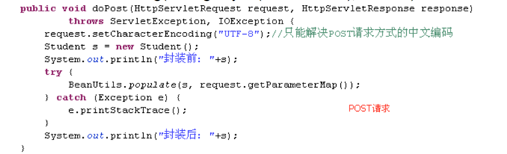
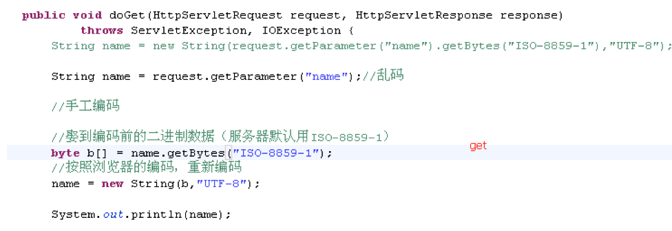
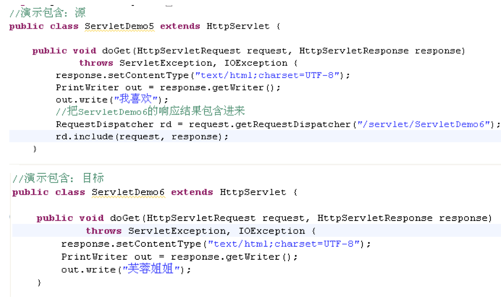

# 各种表单输入域信息的获取
注意：
```html
input type=”text” name=”name” 这样的输入域，用户没有输入值，服务器得到的是 空字符串 ""
Input type=”radio”/type=”checkbox” 这样的输入域，用户没有选择任何选项，服务器得到的是 null。
```

# 请求参数中文编码
IE当前是什么编码，就查什么码表向服务器传递数据，服务器收到数据后，查ISO-8859-1码表进行解码。

POST请求（建议）：`request.setCharacterEncoding(“UTF-8”)；`,设置查询的码表


GET请求：`new String(name.getBytes(“ISO-8859-1”), ”UTF-8”)；`， 手工编码



# 请求转发forward()、重定向sendRedirect()、请求包含include() 的区别
前者把req和resp对象传递到目标servlet（本身不再处理），当前地址栏URL不变。

后者不会传递请求响应对象，URL地址栏会变化。

ServletContext的转发：转发的路径，必须以”/”开头，表示绝对路径（ / 代表当前应用）

Request的转发：转发的路径，
- 可以以”/”开头，表示绝对路径（ / 代表当前应用）；
- 可以不以”/”开头，表示相对路径。

请求包含

有些分工合作做一件事的意思，会把其他servlet的响应结果包含到当前发起请求包含的servlet的响应中



# 各种URL地址的写法
- 相对路径
- 绝对路径（推荐）

**经验分享：给服务器用的地址，/ 就代表者当前应用。给浏览器用的地址，必须加上项目名称**

```
重定向：response.sendRedirect("/项目名称/servlet/ServletDemo2"); 给浏览器用
请求转发：request.getRequestDispatcher("/servlet/ServletDemo4"); 给服务器用
超链接：<a href=”/项目名称/1.html”/> 给浏览器用
表单：<form action=”/项目名称/servlet/ServletDemo1”/>  给浏览器用
```


